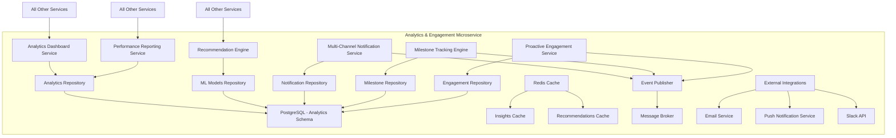

# Analytics & Engagement - High Level Design

## Overview
The Analytics & Engagement microservice provides comprehensive insights, personalized recommendations, and multi-channel customer engagement. It serves as the intelligence layer of the loyalty program.

## Strategic Components

### 1. Analytics Dashboard Service
**Responsibility**: Generate comprehensive spending insights and visualizations
**Key Functions**:
- Create spending summaries and trend analysis
- Generate visual charts and reports
- Provide comparative analysis across time periods
- Track points earning patterns and optimization opportunities

### 2. Recommendation Engine
**Responsibility**: Provide personalized recommendations for reward optimization
**Key Functions**:
- Analyze spending patterns for category suggestions
- Recommend tier advancement strategies
- Suggest optimal redemption timing
- Provide spending tips for maximum rewards

### 3. Performance Reporting Service
**Responsibility**: Generate program performance reports for administrators
**Key Functions**:
- Track enrollment and activation metrics
- Monitor transaction volume and redemption trends
- Analyze category performance and engagement
- Generate executive dashboards and reports

### 4. Multi-Channel Notification Service
**Responsibility**: Manage notifications across email, push, and Slack channels
**Key Functions**:
- Route notifications to preferred channels
- Manage notification preferences and opt-outs
- Ensure timely and relevant message delivery
- Track notification delivery and engagement

### 5. Milestone Tracking Engine
**Responsibility**: Track and celebrate member milestones and achievements
**Key Functions**:
- Monitor milestone progress (anniversaries, tier advancement)
- Trigger celebration messages and bonus rewards
- Manage milestone definitions and criteria
- Provide visual progress indicators

### 6. Proactive Engagement Service
**Responsibility**: Generate proactive alerts and engagement opportunities
**Key Functions**:
- Alert about expiring points or tier status
- Notify about new promotions and opportunities
- Suggest actions to maximize rewards
- Provide timely redemption recommendations

## Component Architecture

## Data Ownership

### PostgreSQL Tables (analytics schema)
- **member_analytics**: Aggregated member behavior and insights
- **spending_summaries**: Pre-calculated spending analysis
- **recommendation_history**: Generated recommendations and outcomes
- **performance_metrics**: Program performance KPIs and trends
- **notification_preferences**: Member notification settings
- **notification_logs**: Delivery history and engagement tracking
- **milestone_definitions**: Configurable milestone criteria
- **milestone_progress**: Member milestone tracking data
- **engagement_rules**: Proactive engagement trigger rules
- **ml_model_metadata**: Machine learning model versions and performance

### Redis Cache
- **insights_cache**: Pre-calculated analytics for quick access
- **recommendations_cache**: Personalized recommendations
- **notification_queue**: Pending notifications for delivery
- **engagement_triggers**: Active engagement rule evaluations

## API Endpoints

### REST APIs (Synchronous)
- `GET /analytics/{member_id}/dashboard` - Get member analytics dashboard
- `GET /analytics/{member_id}/insights` - Get spending insights
- `GET /recommendations/{member_id}` - Get personalized recommendations
- `GET /reports/performance` - Get program performance reports
- `POST /notifications/send` - Send notification (internal)
- `GET /notifications/{member_id}/preferences` - Get notification preferences
- `PUT /notifications/{member_id}/preferences` - Update notification preferences
- `GET /milestones/{member_id}/progress` - Get milestone progress
- `GET /engagement/{member_id}/alerts` - Get proactive engagement alerts

### Event Subscriptions (Asynchronous)
- **TransactionProcessedEvent** - From Transaction & Points Engine
- **PointsEarnedEvent** - From Transaction & Points Engine
- **MemberEnrolledEvent** - From Core Member Management
- **TierAdvancedEvent** - From Core Member Management
- **RedemptionProcessedEvent** - From Rewards & Redemption
- **CategoryUpdatedEvent** - From Rewards & Redemption

## Event Publications

### Outbound Events
- **InsightGeneratedEvent**: New analytics insights available
- **RecommendationCreatedEvent**: New recommendation generated
- **NotificationSentEvent**: Notification delivered successfully
- **MilestoneAchievedEvent**: Member reached milestone
- **EngagementAlertTriggeredEvent**: Proactive alert generated

## Integration Points

### Inbound Dependencies
- **All Services**: Data aggregation for analytics and insights
- **External Data Sources**: Market data for benchmarking

### Outbound Integrations
- **Email Service Provider**: Transactional and marketing emails
- **Push Notification Service**: Mobile app notifications
- **Slack API**: Workspace notifications and alerts
- **Business Intelligence Tools**: Executive reporting integration

## Machine Learning Components

### Recommendation Models
- **Collaborative Filtering**: Similar member behavior analysis
- **Content-Based Filtering**: Category preference modeling
- **Hybrid Approach**: Combined recommendation strategies
- **A/B Testing Framework**: Model performance optimization

### Predictive Analytics
- **Churn Prediction**: Identify at-risk members
- **Lifetime Value Modeling**: Predict member CLV
- **Engagement Scoring**: Member engagement likelihood
- **Redemption Propensity**: Optimal redemption timing

### Real-Time Processing
- **Stream Processing**: Real-time event analysis
- **Feature Engineering**: Dynamic feature calculation
- **Model Serving**: Low-latency prediction serving
- **Model Monitoring**: Performance drift detection

## Performance Requirements
- **Dashboard Loading**: <3 seconds for analytics dashboard
- **Recommendation Generation**: <1 second for personalized recommendations
- **Notification Delivery**: <30 seconds for time-sensitive alerts
- **Report Generation**: <10 seconds for standard performance reports

## Security Considerations
- **Data Privacy**: Anonymization of sensitive analytics data
- **Access Control**: Role-based access to performance reports
- **Notification Security**: Secure delivery channel validation
- **ML Model Security**: Model tampering and adversarial attack protection

## Scalability Design
- **Microservice Architecture**: Independent scaling of analytics components
- **Data Pipeline**: Batch and stream processing for large datasets
- **Caching Strategy**: Multi-level caching for insights and recommendations
- **ML Infrastructure**: Scalable model training and serving

## Monitoring & Observability
- **Analytics Metrics**: Insight generation rates, recommendation accuracy
- **Engagement Metrics**: Notification delivery rates, click-through rates
- **ML Metrics**: Model performance, prediction accuracy, drift detection
- **Business Metrics**: Member engagement scores, program effectiveness

## Technology Stack
- **Framework**: FastAPI with async processing capabilities
- **Analytics**: Pandas, NumPy for data analysis
- **Machine Learning**: Scikit-learn, TensorFlow/PyTorch for ML models
- **Database**: PostgreSQL with analytical query optimization
- **Cache**: Redis for real-time insights and recommendations
- **Message Queue**: Celery for background task processing
- **Visualization**: Plotly/Matplotlib for chart generation