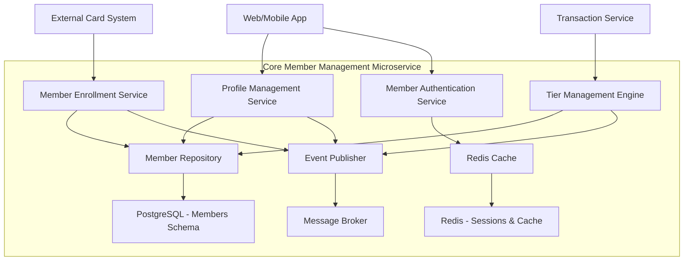

# Core Member Management - High Level Design

## Overview
The Core Member Management microservice handles member lifecycle, tier progression, and profile management. It serves as the foundational service for the loyalty program.

## Strategic Components

### 1. Member Enrollment Service
**Responsibility**: Handle new member registration and program opt-in
**Key Functions**:
- Validate card eligibility
- Create member profile
- Initialize Bronze tier status
- Trigger enrollment events

### 2. Profile Management Service
**Responsibility**: Manage member profile data and preferences
**Key Functions**:
- CRUD operations on member profiles
- Notification preference management
- Profile validation and updates
- Privacy settings management

### 3. Tier Management Engine
**Responsibility**: Handle tier progression logic and benefits
**Key Functions**:
- Track annual spending for tier qualification
- Automatic tier advancement processing
- Tier benefit configuration and access
- Tier progress calculation

### 4. Member Authentication Service
**Responsibility**: Secure member access and session management
**Key Functions**:
- Member authentication and authorization
- Session management with Redis
- Security token generation
- Access control for tier-specific features

## Component Architecture

## Data Ownership

### PostgreSQL Tables (members schema)
- **members**: Core member information and enrollment data
- **member_profiles**: Detailed profile information and preferences
- **tier_status**: Current tier information and progression history
- **tier_benefits**: Tier benefit definitions and configurations
- **member_preferences**: Notification and privacy preferences

### Redis Cache
- **member_sessions**: Active user sessions
- **member_profiles_cache**: Frequently accessed profile data
- **tier_status_cache**: Current tier status for quick lookups

## API Endpoints

### REST APIs (Synchronous)
- `POST /members/enroll` - Member enrollment
- `GET /members/{id}/profile` - Get member profile
- `PUT /members/{id}/profile` - Update member profile
- `GET /members/{id}/tier-status` - Get current tier status
- `GET /members/{id}/tier-progress` - Get tier advancement progress
- `POST /auth/login` - Member authentication
- `POST /auth/logout` - Session termination

### Event Subscriptions (Asynchronous)
- **SpendingUpdatedEvent** - From Transaction & Points Engine
- **RedemptionProcessedEvent** - From Rewards & Redemption

## Event Publications

### Outbound Events
- **MemberEnrolledEvent**: New member registration completed
- **ProfileUpdatedEvent**: Member profile information changed
- **TierAdvancedEvent**: Member advanced to higher tier
- **TierBenefitsUpdatedEvent**: Tier benefits configuration changed

## Integration Points

### Inbound Dependencies
- **External Card System**: Card validation and eligibility checks
- **Transaction & Points Engine**: Spending data for tier progression

### Outbound Integrations
- **Email Service**: Enrollment confirmations and tier notifications
- **All Other Services**: Member profile and tier status data

## Security Considerations
- **Authentication**: JWT tokens with Redis session management
- **Authorization**: Role-based access control (member, admin)
- **Data Privacy**: PII encryption and GDPR compliance
- **API Security**: Rate limiting and input validation

## Scalability Design
- **Horizontal Scaling**: Stateless service design
- **Caching Strategy**: Redis for frequently accessed data
- **Database Optimization**: Indexed queries and connection pooling
- **Event Processing**: Asynchronous handling for tier calculations

## Monitoring & Observability
- **Health Checks**: Service health and database connectivity
- **Metrics**: Enrollment rates, tier advancement frequency
- **Logging**: Structured logging for audit trails
- **Tracing**: Distributed tracing for request flows

## Technology Stack
- **Framework**: FastAPI with Pydantic models
- **Database**: PostgreSQL with SQLAlchemy ORM
- **Cache**: Redis for sessions and frequently accessed data
- **Messaging**: Kafka/RabbitMQ for event publishing
- **Authentication**: JWT with Redis session store