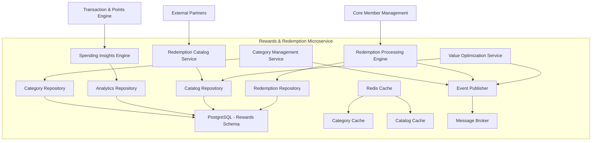

# Rewards & Redemption - High Level Design

## Overview
The Rewards & Redemption microservice manages bonus categories, spending insights, and point redemption processes. It provides customer-facing value through category optimization and flexible redemption options.

## Strategic Components

### 1. Category Management Service
**Responsibility**: Manage bonus categories and multiplier rules
**Key Functions**:
- Define and update bonus categories
- Configure category multipliers and spending caps
- Manage seasonal/promotional category changes
- Provide category information to other services

### 2. Spending Insights Engine
**Responsibility**: Analyze spending patterns and provide recommendations
**Key Functions**:
- Calculate category-wise spending breakdowns
- Generate spending trend analysis
- Provide category optimization recommendations
- Track spending against category caps

### 3. Redemption Catalog Service
**Responsibility**: Manage available redemption options and inventory
**Key Functions**:
- Maintain redemption catalog (cashback, travel, merchandise)
- Manage inventory and availability
- Calculate redemption values and rates
- Handle tier-exclusive redemption options

### 4. Redemption Processing Engine
**Responsibility**: Process manual and automatic redemptions
**Key Functions**:
- Execute manual redemption requests
- Process automatic cashback redemptions
- Validate point balances and eligibility
- Generate redemption confirmations and tracking

### 5. Value Optimization Service
**Responsibility**: Provide redemption value analysis and recommendations
**Key Functions**:
- Calculate point-to-dollar values for options
- Identify best value redemption opportunities
- Provide personalized redemption recommendations
- Track promotional redemption bonuses

## Component Architecture

## Data Ownership

### PostgreSQL Tables (rewards schema)
- **categories**: Bonus category definitions and rules
- **category_multipliers**: Current and historical multiplier rates
- **spending_analytics**: Aggregated spending data by category
- **redemption_catalog**: Available redemption options and rates
- **redemption_inventory**: Stock levels and availability
- **redemption_transactions**: Completed redemption history
- **automatic_redemption_configs**: Member auto-redemption settings
- **value_calculations**: Redemption value analysis results

### Redis Cache
- **active_categories_cache**: Current bonus categories and multipliers
- **catalog_cache**: Frequently accessed redemption options
- **member_insights_cache**: Pre-calculated spending insights
- **redemption_rates_cache**: Current redemption value rates

## API Endpoints

### REST APIs (Synchronous)
- `GET /categories/active` - Get current bonus categories
- `GET /categories/{member_id}/insights` - Get spending insights
- `GET /redemptions/catalog` - Browse redemption catalog
- `POST /redemptions/manual` - Process manual redemption
- `GET /redemptions/{member_id}/history` - Get redemption history
- `PUT /redemptions/{member_id}/auto-config` - Configure auto-redemption
- `GET /redemptions/value-analysis` - Get redemption value comparison
- `GET /categories/{member_id}/recommendations` - Get category recommendations

### Event Subscriptions (Asynchronous)
- **TransactionProcessedEvent** - From Transaction & Points Engine
- **PointsEarnedEvent** - From Transaction & Points Engine
- **BalanceUpdatedEvent** - From Transaction & Points Engine
- **TierAdvancedEvent** - From Core Member Management

## Event Publications

### Outbound Events
- **CategoryUpdatedEvent**: Bonus category rules changed
- **RedemptionProcessedEvent**: Redemption completed successfully
- **AutoRedemptionTriggeredEvent**: Automatic cashback processed
- **SpendingInsightGeneratedEvent**: New insights available
- **RedemptionValueUpdatedEvent**: Redemption rates changed

## Integration Points

### Inbound Dependencies
- **Transaction & Points Engine**: Transaction and balance data
- **Core Member Management**: Member profile and tier information
- **External Partners**: Redemption fulfillment services

### Outbound Integrations
- **Analytics & Engagement**: Insights data for recommendations
- **External Fulfillment**: Travel and merchandise redemptions
- **Payment Systems**: Cashback processing

## Business Logic Components

### Category Management Rules
- **Seasonal Categories**: Quarterly bonus category rotations
- **Spending Caps**: Monthly limits on bonus category earnings
- **Tier Multipliers**: Enhanced rates for higher tier members
- **Promotional Categories**: Limited-time bonus opportunities

### Redemption Value Engine
- **Dynamic Pricing**: Market-based redemption rates
- **Tier Benefits**: Exclusive redemption options by tier
- **Promotional Bonuses**: Limited-time redemption value boosts
- **Inventory Management**: Real-time availability tracking

### Automatic Redemption Logic
- **Threshold Triggers**: Configurable point balance thresholds
- **Member Preferences**: Cashback vs statement credit options
- **Frequency Controls**: Daily/monthly redemption limits
- **Eligibility Validation**: Account status and balance verification

## Performance Requirements
- **Response Time**: <1 second for catalog browsing
- **Redemption Processing**: <5 seconds for standard redemptions
- **Insights Generation**: Real-time spending analysis updates
- **Catalog Updates**: Near real-time inventory synchronization

## Security Considerations
- **Redemption Validation**: Multi-factor authentication for high-value redemptions
- **Fraud Prevention**: Suspicious redemption pattern detection
- **Data Privacy**: Spending pattern data protection
- **API Security**: Rate limiting and input validation

## Scalability Design
- **Microservice Architecture**: Independent scaling of components
- **Caching Strategy**: Redis for frequently accessed catalog data
- **Database Optimization**: Indexed queries for spending analytics
- **Event-Driven Updates**: Asynchronous processing for insights

## Monitoring & Observability
- **Business Metrics**: Redemption rates, category utilization, value optimization
- **Performance Metrics**: API response times, processing throughput
- **Inventory Monitoring**: Stock levels and availability alerts
- **User Behavior**: Redemption patterns and preferences

## Technology Stack
- **Framework**: FastAPI with background task processing
- **Database**: PostgreSQL with analytical query optimization
- **Cache**: Redis for catalog and insights caching
- **Analytics**: Pandas/NumPy for spending analysis calculations
- **Messaging**: Kafka for event-driven architecture