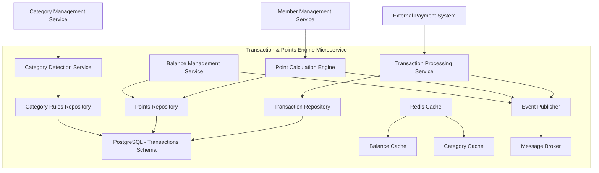

# Transaction & Points Engine - High Level Design

## Overview
The Transaction & Points Engine microservice handles real-time transaction processing, point calculations, and balance management. It serves as the core business logic engine for the loyalty program.

## Strategic Components

### 1. Transaction Processing Service
**Responsibility**: Process incoming card transactions in real-time
**Key Functions**:
- Receive transaction events from payment system
- Validate transaction data and member eligibility
- Apply business rules and fraud detection
- Store transaction records with audit trail

### 2. Point Calculation Engine
**Responsibility**: Calculate points earned based on transactions and rules
**Key Functions**:
- Apply base point rates (1x per dollar)
- Calculate category multipliers (2x-3x)
- Handle tier-based bonus multipliers
- Process promotional point bonuses

### 3. Balance Management Service
**Responsibility**: Maintain accurate point balances and history
**Key Functions**:
- Real-time balance updates
- Point expiration management
- Balance inquiry and history
- Pending points tracking

### 4. Category Detection Service
**Responsibility**: Classify transactions by merchant category
**Key Functions**:
- MCC (Merchant Category Code) analysis
- Merchant name pattern matching
- Category rule application
- Bonus category identification

## Component Architecture

## Data Ownership

### PostgreSQL Tables (transactions schema)
- **transactions**: All card transaction records
- **point_calculations**: Point calculation details and audit trail
- **point_balances**: Current and historical point balances
- **point_transactions**: Point earning and redemption history
- **category_mappings**: MCC to category mappings
- **calculation_rules**: Point calculation rules and multipliers

### Redis Cache
- **balance_cache**: Real-time point balances for quick access
- **category_rules_cache**: Frequently used category rules
- **member_tier_cache**: Member tier information for calculations
- **pending_transactions**: Temporary storage for processing transactions

## API Endpoints

### REST APIs (Synchronous)
- `GET /points/balance/{member_id}` - Get current point balance
- `GET /transactions/{member_id}` - Get transaction history
- `GET /transactions/{member_id}/points` - Get points earning history
- `POST /points/calculate` - Calculate points for transaction (internal)
- `GET /categories/{transaction_id}` - Get transaction category
- `GET /health` - Service health check

### Event Subscriptions (Asynchronous)
- **TransactionAuthorizedEvent** - From External Payment System
- **TransactionSettledEvent** - From External Payment System
- **MemberTierAdvancedEvent** - From Core Member Management
- **CategoryRulesUpdatedEvent** - From Rewards & Redemption

## Event Publications

### Outbound Events
- **TransactionProcessedEvent**: Transaction successfully processed
- **PointsEarnedEvent**: Points calculated and awarded
- **BalanceUpdatedEvent**: Point balance changed
- **SpendingMilestoneEvent**: Member reached spending milestone
- **CategoryDetectedEvent**: Transaction categorized

## Integration Points

### Inbound Dependencies
- **External Payment System**: Real-time transaction feeds
- **Core Member Management**: Member profile and tier information
- **Rewards & Redemption**: Category rules and multipliers

### Outbound Integrations
- **All Services**: Transaction and points data
- **Analytics & Engagement**: Transaction data for insights
- **Rewards & Redemption**: Balance updates for redemptions

## Business Rules Engine

### Point Calculation Rules
- **Base Rate**: 1 point per $1 spent (configurable)
- **Category Multipliers**: 2x-3x for bonus categories
- **Tier Bonuses**: Additional multipliers based on member tier
- **Promotional Bonuses**: Time-limited bonus point campaigns

### Transaction Validation Rules
- **Member Eligibility**: Active program membership required
- **Transaction Limits**: Daily/monthly spending limits
- **Fraud Detection**: Suspicious transaction patterns
- **Category Exclusions**: Certain MCCs excluded from points

## Performance Requirements
- **Real-time Processing**: <2 second response time for point calculations
- **Throughput**: Handle 10,000+ transactions per minute
- **Accuracy**: 99.99% accuracy in point calculations
- **Availability**: 99.9% uptime with failover capabilities

## Security Considerations
- **Data Encryption**: PCI DSS compliance for transaction data
- **API Security**: Authentication and rate limiting
- **Audit Logging**: Complete audit trail for all transactions
- **Data Privacy**: Tokenization of sensitive payment data

## Scalability Design
- **Horizontal Scaling**: Stateless microservice architecture
- **Database Sharding**: Partition by member ID for large datasets
- **Caching Strategy**: Redis for frequently accessed balances
- **Event Streaming**: Kafka for high-throughput event processing

## Monitoring & Observability
- **Performance Metrics**: Transaction processing times and throughput
- **Business Metrics**: Points earned, balance changes, error rates
- **Health Monitoring**: Database connectivity and external system status
- **Alerting**: Real-time alerts for processing failures or delays

## Technology Stack
- **Framework**: FastAPI with async/await for high performance
- **Database**: PostgreSQL with optimized indexing
- **Cache**: Redis for real-time balance caching
- **Messaging**: Kafka for high-volume event streaming
- **Validation**: Pydantic for data validation and serialization