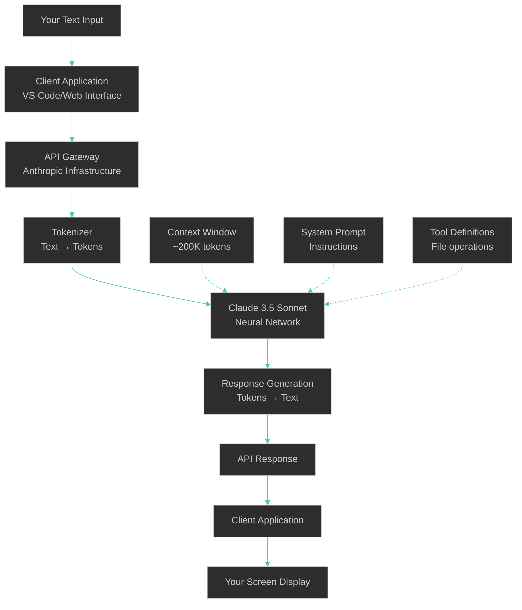
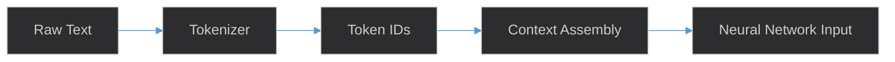
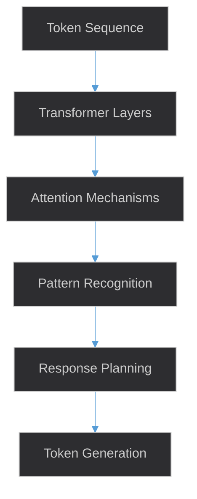
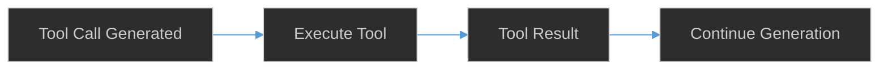
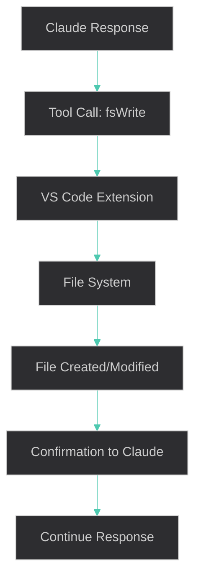

# Claude 3.5 Sonnet - Text Processing Flow

## AI Processing Flow Diagram



## Model Information

**Model**: Claude 3.5 Sonnet (not Claude 4)  
**Developer**: Anthropic  
**Context Window**: ~200,000 tokens  
**Capabilities**: Text generation, code analysis, tool usage, file operations  

## Tokenization Process

### Who Does the Conversion
- **Anthropic's tokenizer** (part of Claude infrastructure)
- Happens **before** text reaches my neural network
- Uses **subword tokenization** (similar to GPT's BPE)

### Token Conversion Examples
```
Input Text                    → Tokens                           → Count
"Hello world"                → ["Hello", " world"]              → 2 tokens
"PremiumCard"                → ["Premium", "Card"]              → 2 tokens  
"workdir/inception/"         → ["work", "dir", "/", "inc", "eption", "/"] → 6 tokens
"user stories"               → ["user", " stories"]             → 2 tokens
"@filename"                  → ["@", "filename"]                → 2 tokens
```

## Processing Steps

### 1. Input Processing


### 2. Context Assembly
- **Your message tokens** + **conversation history** + **system prompt** + **tool definitions**
- Total must stay within ~200K token limit
- Older messages may be truncated if limit exceeded

### 3. Neural Processing


### 4. Output Generation
- Model generates response tokens one at a time
- Each token prediction based on all previous context
- Tool calls generated as structured output when needed

### 5. Tool Execution (if applicable)


## Key Technical Details

### What I Don't Control
- **Tokenization process** - handled by Anthropic infrastructure
- **Token counting** - no direct access to token counts
- **Context window management** - automatic truncation
- **Model parameters** - fixed neural network weights

### What I Can Do
- **Generate text responses** based on input context
- **Execute tools** like file operations, bash commands
- **Maintain conversation flow** within single session
- **Process structured data** like code, markdown, JSON

### Processing Time Breakdown
| Step | Typical Duration | Notes |
|------|------------------|-------|
| Tokenization | <10ms | Very fast, optimized |
| Neural Processing | 100-2000ms | Depends on response length |
| Tool Execution | 50-500ms | Depends on tool complexity |
| Detokenization | <10ms | Very fast |

## Context Window Management

### Token Usage
- **Input tokens**: Your message + conversation history + system prompt
- **Output tokens**: My response + tool calls
- **Total limit**: ~200,000 tokens combined
- **Automatic management**: Older messages truncated if needed

### Optimization Tips
- Use `@filename` to reference files efficiently
- Break long conversations into focused sessions
- Reference key documents rather than repeating content
- Use concise, specific prompts

## Integration with VS Code

### File Operations


### Available Tools
- **fsRead**: Read file contents
- **fsWrite**: Create/modify files
- **listDirectory**: Browse file structure
- **executeBash**: Run shell commands
- **fileSearch**: Find files by name
- **codeReview**: Analyze code quality

This processing happens seamlessly in the background, allowing for natural conversation flow while maintaining access to your workspace files and tools.