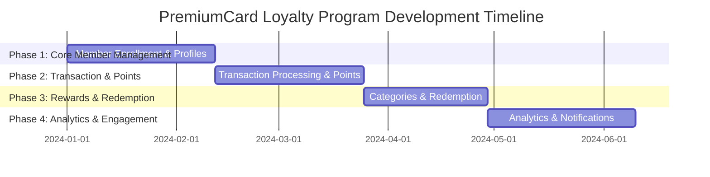

# Development Metrics & Timeline - PremiumCard Loyalty Program

## Project Timeline Overview

```
Total Project Duration: 17-23 weeks (4.25-5.75 months)
Team Size: 2-3 Junior Developers
Total User Stories: 21
```

## Development Phase Timeline



## Completion Percentage by Phase

```
┌─────────────────────────────────────────────────────────────────────────────────┐
│                        Project Completion Metrics                              │
├─────────────────────────────────────────────────────────────────────────────────┤
│                                                                                 │
│  Phase 1: Core Member Management                                               │
│  ████████████████████████████▓▓ 28.6% (6 stories / 21 total)                  │
│  Week 1-6 | Foundation Features                                               │
│                                                                                 │
│  Phase 2: Transaction & Points Engine                                          │
│  ████████████████████████████████████████████▓▓ 47.6% (10 stories / 21 total) │
│  Week 7-12 | Core Business Logic                                              │
│                                                                                 │
│  Phase 3: Rewards & Redemption                                                 │
│  ████████████████████████████████████████████████████████████▓▓ 71.4% (15/21)  │
│  Week 13-17 | Customer Value Features                                         │
│                                                                                 │
│  Phase 4: Analytics & Engagement                                               │
│  ████████████████████████████████████████████████████████████████████ 100%    │
│  Week 18-23 | Advanced Features                                               │
│                                                                                 │
└─────────────────────────────────────────────────────────────────────────────────┘
```

## Detailed Phase Metrics

### Phase 1: Core Member Management (Weeks 1-6)
```
┌─────────────────────────────────────────────────────────────┐
│ User Stories: 6/21 (28.6%)                                 │
│ Duration: 4-6 weeks                                         │
│ Complexity: Low ⭐⭐                                        │
│ Business Value: High 🔥🔥🔥                                │
│ Risk: Low ✅                                               │
│                                                             │
│ Deliverables:                                               │
│ • Member enrollment system                                  │
│ • Profile management                                        │
│ • Tier progression engine                                   │
│ • Basic tier benefits                                       │
└─────────────────────────────────────────────────────────────┘
```

### Phase 2: Transaction & Points Engine (Weeks 7-12)
```
┌─────────────────────────────────────────────────────────────┐
│ User Stories: 4/21 (19.0%) | Cumulative: 47.6%            │
│ Duration: 4-6 weeks                                         │
│ Complexity: Medium ⭐⭐⭐                                   │
│ Business Value: Critical 🔥🔥🔥🔥                          │
│ Risk: Medium ⚠️                                            │
│                                                             │
│ Deliverables:                                               │
│ • Real-time transaction processing                          │
│ • Point calculation engine                                  │
│ • Transaction history                                       │
│ • Point balance tracking                                    │
└─────────────────────────────────────────────────────────────┘
```

### Phase 3: Rewards & Redemption (Weeks 13-17)
```
┌─────────────────────────────────────────────────────────────┐
│ User Stories: 5/21 (23.8%) | Cumulative: 71.4%            │
│ Duration: 4-5 weeks                                         │
│ Complexity: Medium-High ⭐⭐⭐⭐                            │
│ Business Value: High 🔥🔥🔥                                │
│ Risk: Medium ⚠️                                            │
│                                                             │
│ Deliverables:                                               │
│ • Category management system                                │
│ • Redemption catalog                                        │
│ • Automatic cashback                                        │
│ • Spending insights                                         │
└─────────────────────────────────────────────────────────────┘
```

### Phase 4: Analytics & Engagement (Weeks 18-23)
```
┌─────────────────────────────────────────────────────────────┐
│ User Stories: 6/21 (28.6%) | Cumulative: 100%             │
│ Duration: 5-6 weeks                                         │
│ Complexity: High ⭐⭐⭐⭐⭐                                 │
│ Business Value: Medium 🔥🔥                                │
│ Risk: High ⚠️⚠️                                           │
│                                                             │
│ Deliverables:                                               │
│ • Analytics dashboard                                       │
│ • Recommendation engine                                     │
│ • Multi-channel notifications                               │
│ • Performance reporting                                     │
└─────────────────────────────────────────────────────────────┘
```

## Weekly Progress Tracking

| Week | Phase | Stories Complete | Cumulative % | Milestone |
|------|-------|------------------|--------------|-----------|
| 6    | 1     | 6/21            | 28.6%        | MVP Foundation Ready |
| 12   | 2     | 10/21           | 47.6%        | Core System Functional |
| 17   | 3     | 15/21           | 71.4%        | Customer-Ready Features |
| 23   | 4     | 21/21           | 100%         | Full System Complete |

## Risk & Mitigation Timeline

```
Week 1-6:   Low Risk    ✅ Foundation building, learning curve
Week 7-12:  Medium Risk ⚠️  Integration complexity, performance
Week 13-17: Medium Risk ⚠️  Business logic complexity
Week 18-23: High Risk   🚨 Advanced features, system integration
```

## Value Delivery Timeline

```
Week 6:  Basic loyalty program operational (28.6% value)
Week 12: Full transaction processing (70% value)
Week 17: Complete customer experience (90% value)
Week 23: Advanced analytics & engagement (100% value)
```

## Resource Allocation

```
┌─────────────────────────────────────────────────────────────┐
│ Team Utilization (2-3 Junior Developers)                   │
│                                                             │
│ Phase 1: 100% Learning & Foundation                        │
│ Phase 2: 100% Core Development                             │
│ Phase 3: 100% Feature Development                          │
│ Phase 4: 80% Development + 20% System Integration          │
└─────────────────────────────────────────────────────────────┘
```