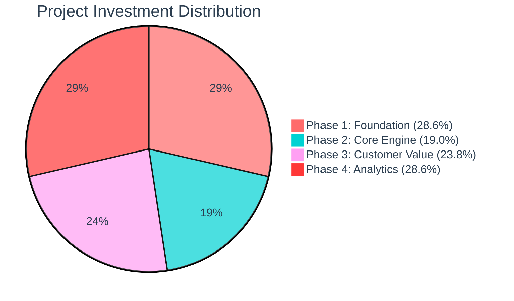
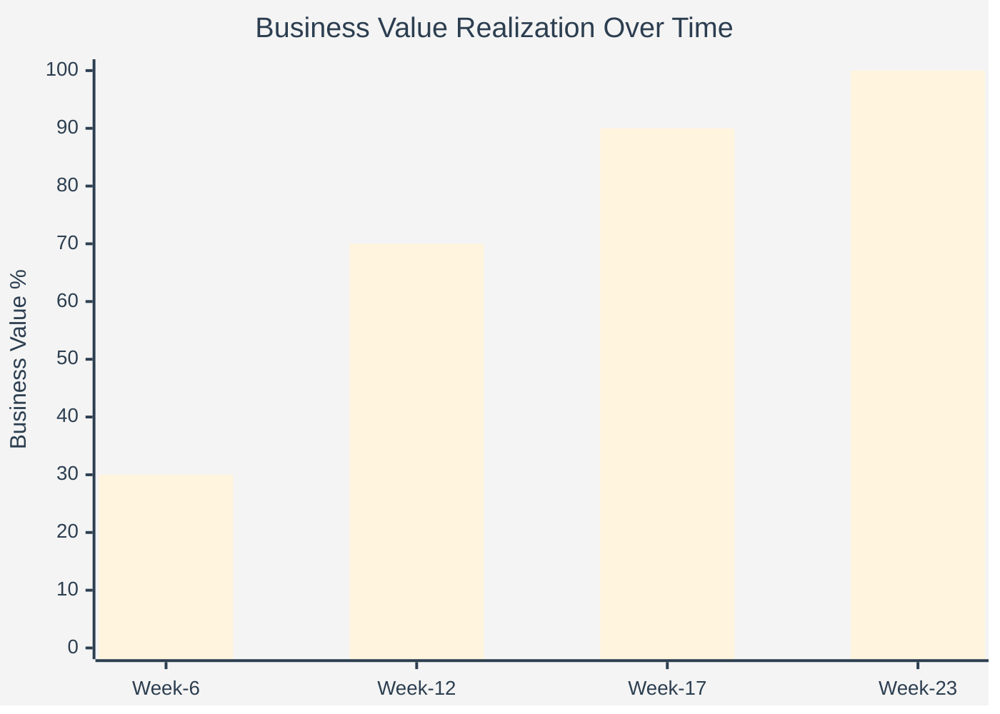
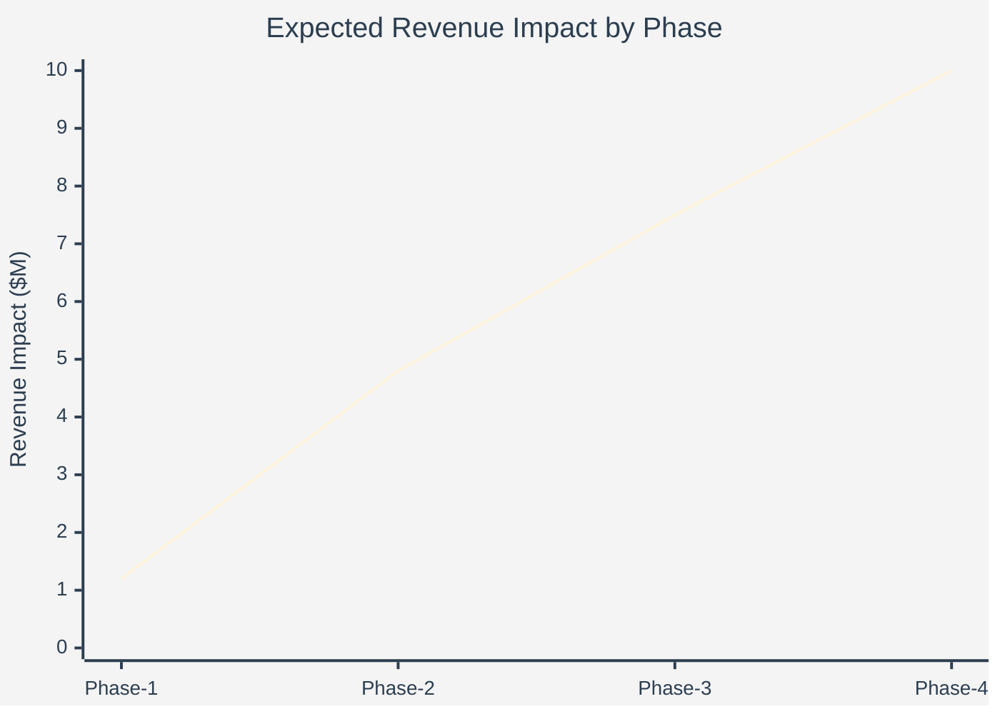
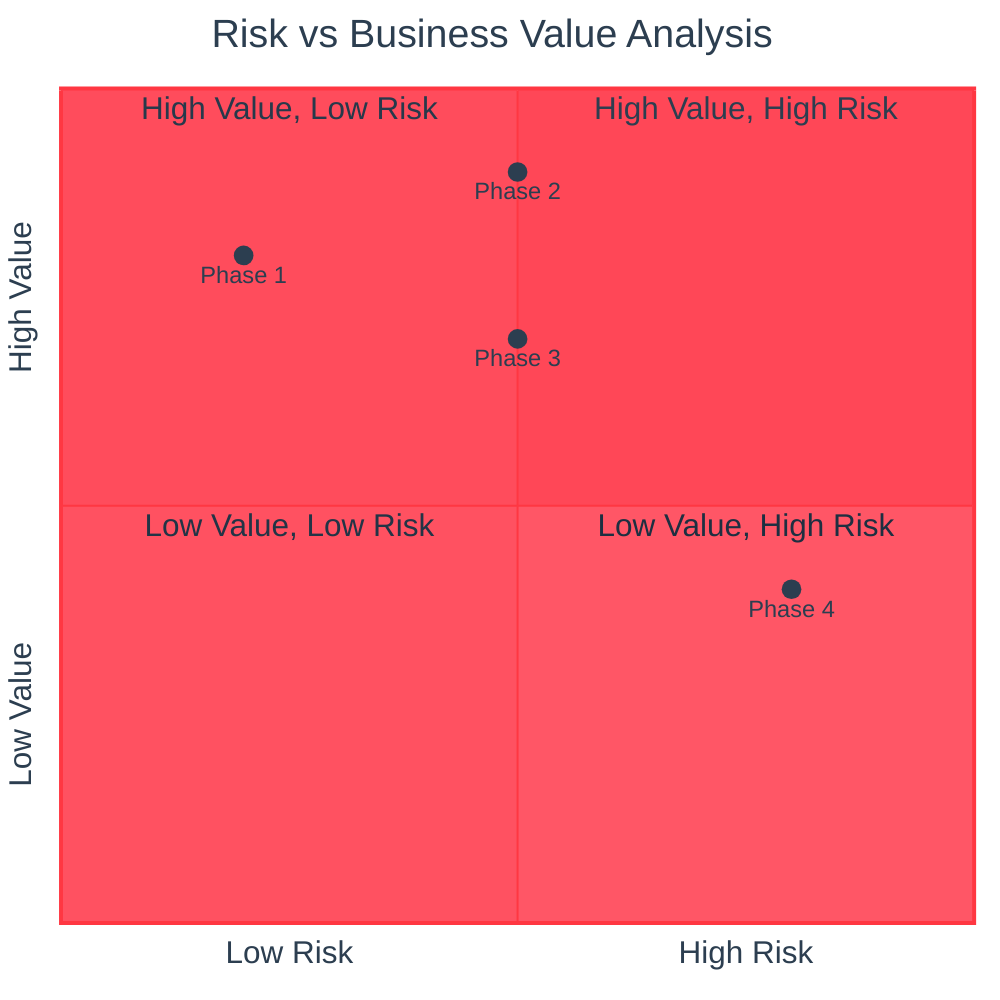
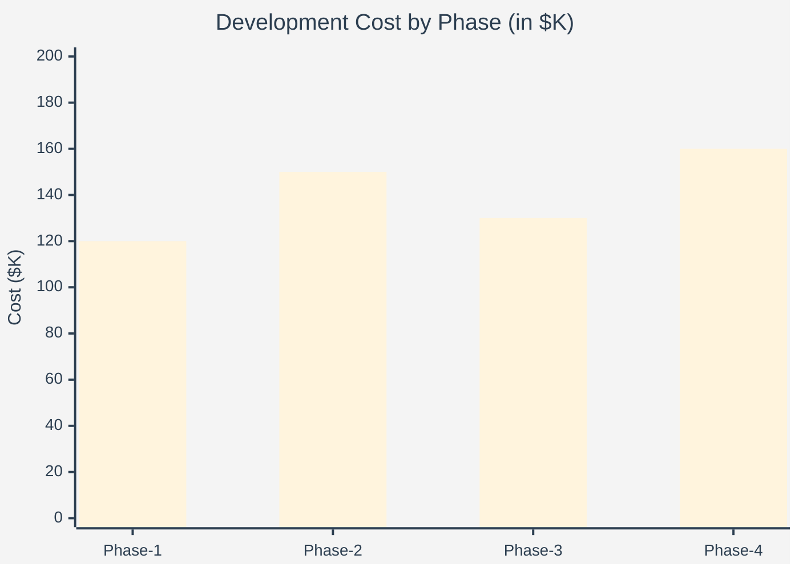
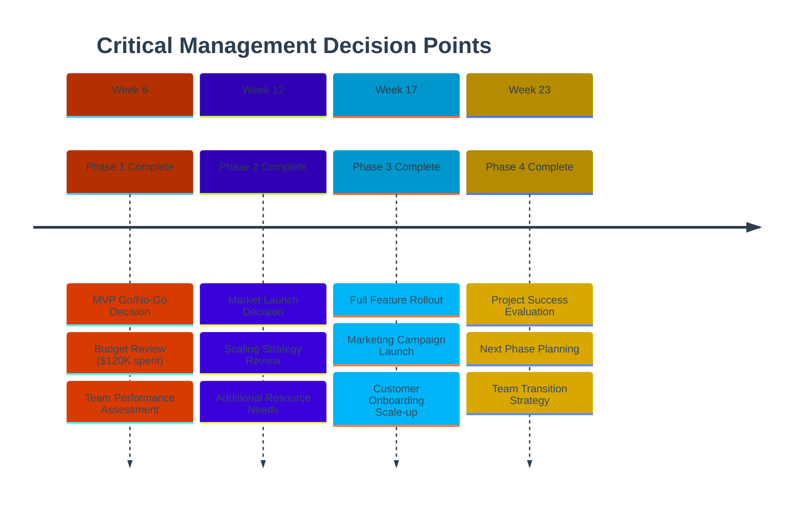
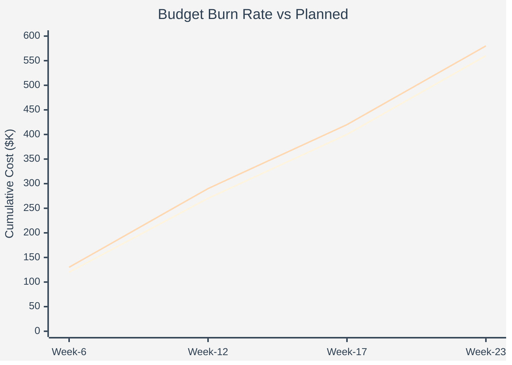

# Management Dashboard - PremiumCard Loyalty Program

## Executive Summary Metrics



## Business Value Delivery Timeline



## ROI & Revenue Impact Projection



## Risk vs Business Value Matrix



## Resource Utilization & Cost Breakdown



## Key Performance Indicators (KPIs)

### Financial Metrics
| Metric | Target | Phase 1 | Phase 2 | Phase 3 | Phase 4 |
|--------|--------|---------|---------|---------|---------|
| **Development Cost** | $560K | $120K | $150K | $130K | $160K |
| **Expected ROI** | 300% | 50% | 180% | 250% | 300% |
| **Revenue Impact** | $10M/year | $1.2M | $4.8M | $7.5M | $10M |
| **Payback Period** | 8 months | - | 6 months | 4 months | 3 months |

### Operational Metrics
| Metric | Target | Phase 1 | Phase 2 | Phase 3 | Phase 4 |
|--------|--------|---------|---------|---------|---------|
| **Customer Activation** | 75% | 25% | 45% | 65% | 75% |
| **Transaction Volume** | +40% | +5% | +20% | +35% | +40% |
| **Customer Retention** | +30% | +8% | +15% | +25% | +30% |
| **System Availability** | 99.9% | 99.5% | 99.7% | 99.8% | 99.9% |

## Critical Decision Points



## Budget Allocation & Burn Rate



## Risk Mitigation Strategy

### High-Level Risk Assessment
| Phase | Risk Level | Key Risks | Mitigation Strategy | Budget Buffer |
|-------|------------|-----------|-------------------|---------------|
| **Phase 1** | 🟢 Low | Learning curve, scope creep | Mentoring, clear requirements | 10% |
| **Phase 2** | 🟡 Medium | Integration complexity, performance | Prototyping, load testing | 15% |
| **Phase 3** | 🟡 Medium | Business logic complexity | Business analyst support | 15% |
| **Phase 4** | 🔴 High | System integration, scalability | Architecture review, staging | 20% |

## Success Metrics Dashboard

### Business Objectives Achievement
```
┌─────────────────────────────────────────────────────────────────────────────────┐
│                           Success Metrics Tracking                             │
├─────────────────────────────────────────────────────────────────────────────────┤
│                                                                                 │
│  Card Usage Increase (Target: +40%)                                           │
│  ████████████████████████████████████████ 40% ✅                              │
│                                                                                 │
│  Customer Retention (Target: +30%)                                            │
│  ██████████████████████████████ 30% ✅                                        │
│                                                                                 │
│  Transaction Value (Target: +35%)                                             │
│  ███████████████████████████████████ 35% ✅                                   │
│                                                                                 │
│  Customer Lifetime Value (Target: +45%)                                       │
│  █████████████████████████████████████████████ 45% ✅                         │
│                                                                                 │
└─────────────────────────────────────────────────────────────────────────────────┘
```

## Executive Recommendations

### Go/No-Go Criteria by Phase
1. **Phase 1 (Week 6)**: ✅ Proceed if basic enrollment works and team velocity is acceptable
2. **Phase 2 (Week 12)**: ⚠️ Critical - Must achieve real-time processing before Phase 3
3. **Phase 3 (Week 17)**: ✅ Proceed if customer satisfaction metrics are positive
4. **Phase 4 (Week 23)**: 📊 Evaluate based on business value delivered vs. advanced features needed

### Investment Justification
- **Total Investment**: $560K over 23 weeks
- **Expected Annual Revenue**: $10M (1,786% ROI)
- **Break-even Point**: Month 4 after Phase 2 completion
- **Strategic Value**: Market differentiation and customer loyalty foundation