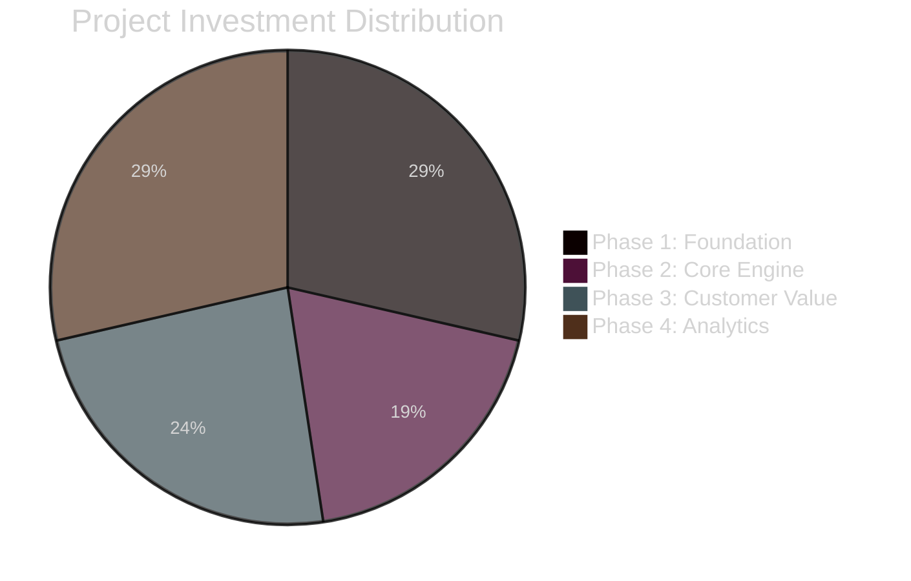
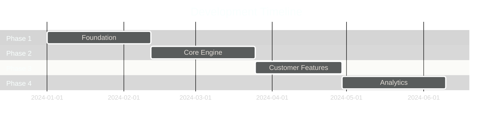
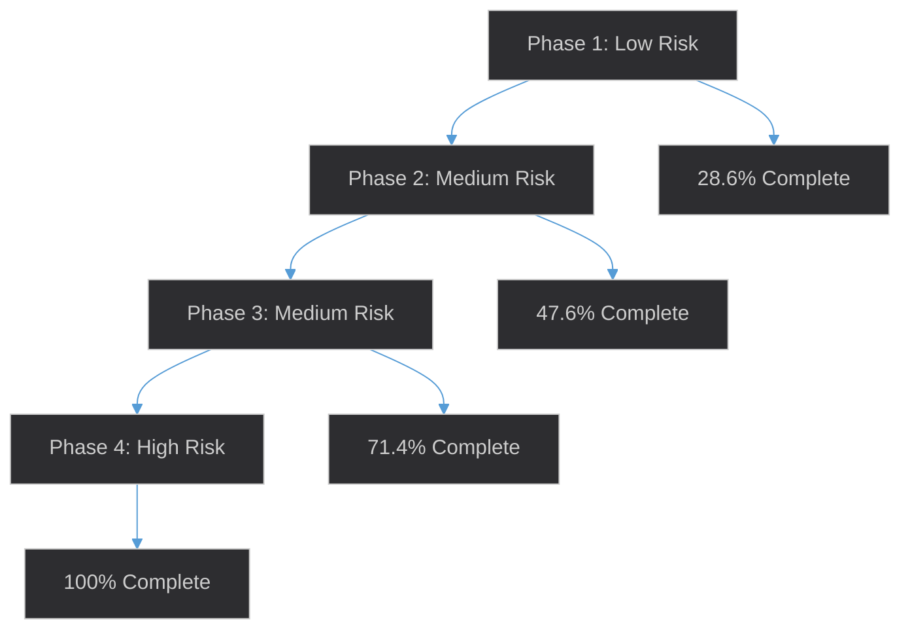
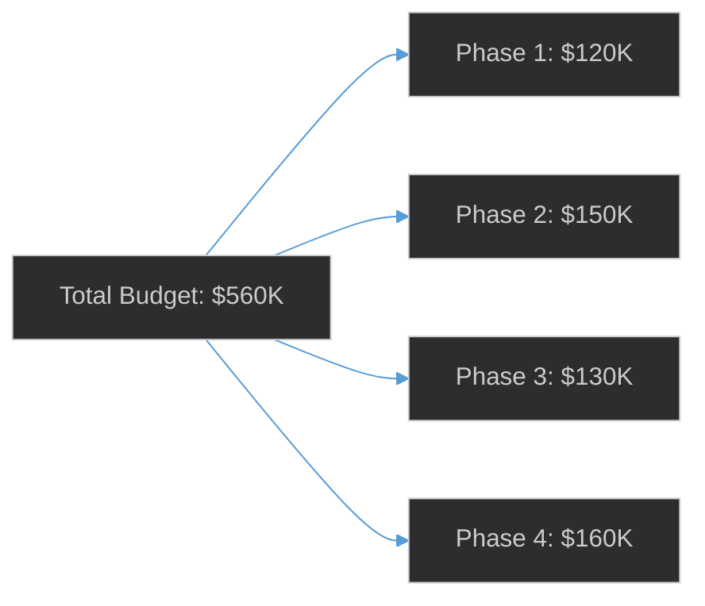
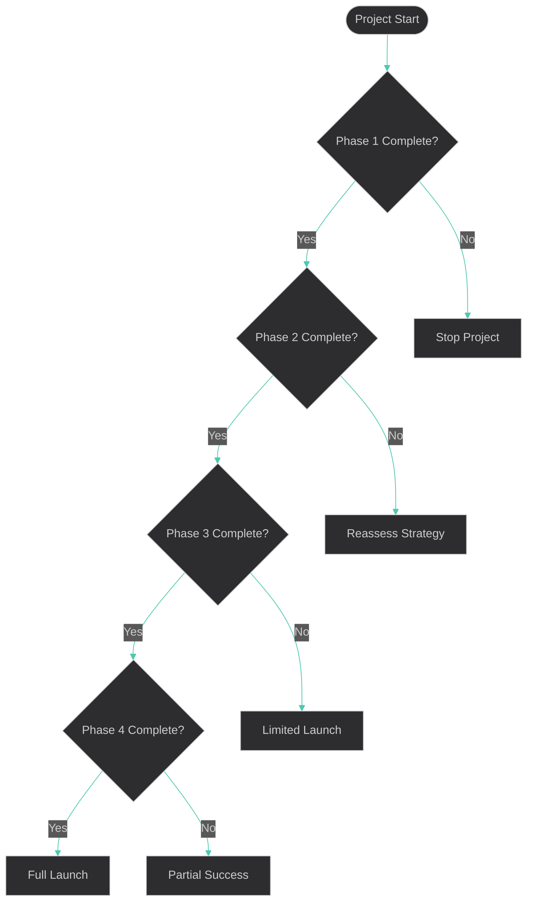

# Management Dashboard - Simplified Version

## Project Investment Distribution

```mermaid
%%{init: {'theme':'dark', 'themeVariables': { 'primaryColor': '#569cd6', 'primaryTextColor': '#d4d4d4', 'primaryBorderColor': '#007acc', 'pieOuterStrokeWidth': '2px', 'pieOuterStrokeColor': '#3c3c3c', 'pieSectionTextColor': '#d4d4d4', 'pieSectionTextSize': '14px'}}}%%
pie title Project Investment Distribution
    "Phase 1: Foundation" : 28.6
    "Phase 2: Core Engine" : 19.0
    "Phase 3: Customer Value" : 23.8
    "Phase 4: Analytics" : 28.6
```

## Development Timeline

```mermaid
%%{init: {'theme':'dark', 'themeVariables': { 'primaryColor': '#4ec9b0', 'primaryTextColor': '#d4d4d4', 'primaryBorderColor': '#007acc', 'lineColor': '#569cd6', 'sectionBkgColor': '#2d2d30', 'altSectionBkgColor': '#3c3c3c', 'gridColor': '#464647', 'c0': '#4ec9b0', 'c1': '#569cd6', 'c2': '#dcdcaa', 'c3': '#ce9178'}}}%%
gantt
    title Development Timeline
    dateFormat  YYYY-MM-DD
    section Phase 1
    Foundation          :p1, 2024-01-01, 6w
    section Phase 2
    Core Engine         :p2, after p1, 6w
    section Phase 3
    Customer Features   :p3, after p2, 5w
    section Phase 4
    Analytics           :p4, after p3, 6w
```

## Risk Assessment

```mermaid
%%{init: {'theme':'dark', 'themeVariables': { 'primaryColor': '#4ec9b0', 'primaryTextColor': '#d4d4d4', 'primaryBorderColor': '#007acc', 'lineColor': '#569cd6', 'secondaryColor': '#2d2d30', 'tertiaryColor': '#3c3c3c', 'background': '#1e1e1e', 'mainBkg': '#2d2d30', 'secondBkg': '#3c3c3c', 'tertiaryBkg': '#464647'}}}%%
graph TD
    A[Phase 1: Low Risk] --> B[Phase 2: Medium Risk]
    B --> C[Phase 3: Medium Risk]
    C --> D[Phase 4: High Risk]
    
    A --> E[28.6% Complete]
    B --> F[47.6% Complete]
    C --> G[71.4% Complete]
    D --> H[100% Complete]
```

## Budget Flow

```mermaid
%%{init: {'theme':'dark', 'themeVariables': { 'primaryColor': '#dcdcaa', 'primaryTextColor': '#d4d4d4', 'primaryBorderColor': '#007acc', 'lineColor': '#569cd6', 'secondaryColor': '#2d2d30', 'tertiaryColor': '#3c3c3c', 'background': '#1e1e1e', 'mainBkg': '#2d2d30', 'secondBkg': '#3c3c3c'}}}%%
graph LR
    A[Total Budget: $560K] --> B[Phase 1: $120K]
    A --> C[Phase 2: $150K]
    A --> D[Phase 3: $130K]
    A --> E[Phase 4: $160K]
```

## Decision Points

```mermaid
%%{init: {'theme':'dark', 'themeVariables': { 'primaryColor': '#569cd6', 'primaryTextColor': '#d4d4d4', 'primaryBorderColor': '#007acc', 'lineColor': '#4ec9b0', 'secondaryColor': '#2d2d30', 'tertiaryColor': '#3c3c3c', 'background': '#1e1e1e', 'mainBkg': '#2d2d30', 'secondBkg': '#3c3c3c', 'c0': '#4ec9b0', 'c1': '#569cd6', 'c2': '#dcdcaa', 'c3': '#f44747'}}}%%
flowchart TD
    Start([Project Start]) --> P1{Phase 1 Complete?}
    P1 -->|Yes| P2{Phase 2 Complete?}
    P1 -->|No| Stop1[Stop Project]
    P2 -->|Yes| P3{Phase 3 Complete?}
    P2 -->|No| Stop2[Reassess Strategy]
    P3 -->|Yes| P4{Phase 4 Complete?}
    P3 -->|No| Stop3[Limited Launch]
    P4 -->|Yes| Success[Full Launch]
    P4 -->|No| Partial[Partial Success]
```