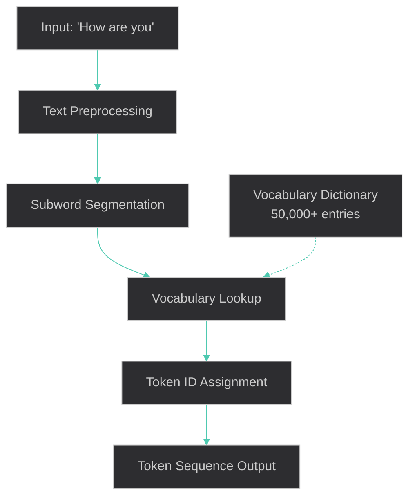

# Tokenization Process - "How are you" Example

## Who Does the Tokenization

**Anthropic's Tokenizer** - Part of Claude's infrastructure, not controlled by me

## Step-by-Step Conversion: "How are you"

### Input Text
```
"How are you"
```

### Tokenization Process



### Implementation Steps

#### Step 1: Text Preprocessing
```
Input: "How are you"
↓
Normalize: "How are you" (no changes needed)
```

#### Step 2: Subword Segmentation (BPE-like)
```
"How are you" → ["How", " are", " you"]
```

**Why spaces matter:**
- `"How"` = word at start
- `" are"` = space + word (indicates word boundary)
- `" you"` = space + word

#### Step 3: Vocabulary Lookup
```
Anthropic's Vocabulary Dictionary (simplified example):
{
  "How": 1234,
  " are": 5678,
  " you": 9012,
  ...50,000+ other entries
}
```

#### Step 4: Token ID Assignment
```
"How" → Token ID: 1234
" are" → Token ID: 5678  
" you" → Token ID: 9012
```

#### Step 5: Final Token Sequence
```
Input: "How are you"
Output: [1234, 5678, 9012]
Token Count: 3 tokens
```

## Detailed Breakdown

### What Anthropic's Tokenizer Does

```python
# Conceptual implementation (not actual code)
def anthropic_tokenizer(text):
    # 1. Preprocessing
    normalized_text = preprocess(text)
    
    # 2. Apply BPE (Byte Pair Encoding) algorithm
    subwords = apply_bpe(normalized_text)
    
    # 3. Convert to token IDs
    token_ids = []
    for subword in subwords:
        token_id = vocabulary_lookup(subword)
        token_ids.append(token_id)
    
    return token_ids

# Example execution:
input_text = "How are you"
tokens = anthropic_tokenizer(input_text)
# Result: [1234, 5678, 9012]
```

### BPE (Byte Pair Encoding) Process

#### Training Phase (Done by Anthropic)
1. **Collect massive text corpus**
2. **Start with character-level tokens**
3. **Iteratively merge most frequent pairs**
4. **Build vocabulary of ~50,000 subwords**

#### Inference Phase (What happens to your text)
```
"How are you"
↓
Split into characters: ['H', 'o', 'w', ' ', 'a', 'r', 'e', ' ', 'y', 'o', 'u']
↓
Apply learned merges:
- 'H' + 'o' → 'Ho'
- 'Ho' + 'w' → 'How'
- ' ' + 'a' → ' a'
- ' a' + 'r' → ' ar'
- ' ar' + 'e' → ' are'
- ' ' + 'y' → ' y'
- ' y' + 'o' → ' yo'
- ' yo' + 'u' → ' you'
↓
Final tokens: ["How", " are", " you"]
```

## Token Characteristics

### Why These Specific Tokens?
| Token | Reason | Frequency in Training |
|-------|--------|----------------------|
| `"How"` | Common question starter | Very high |
| `" are"` | Common verb with space | Very high |
| `" you"` | Common pronoun with space | Very high |

### Alternative Tokenizations (Less Likely)
```
Less efficient options:
"How are you" → ["H", "ow", " ar", "e", " y", "ou"] (6 tokens)
"How are you" → ["How", " ", "are", " ", "you"] (5 tokens)

Anthropic's choice (most efficient):
"How are you" → ["How", " are", " you"] (3 tokens)
```

## Real-World Complexity

### Handling Different Cases
```
"How are you?" → ["How", " are", " you", "?"] (4 tokens)
"how are you" → ["how", " are", " you"] (3 tokens)  
"How're you" → ["How", "'re", " you"] (3 tokens)
"Howareyou" → ["How", "are", "you"] (3 tokens)
```

### Unicode and Special Characters
```
"How are you 😊" → ["How", " are", " you", " ", "😊"] (5 tokens)
"How are you?" → ["How", " are", " you", "?"] (4 tokens)
```
### Architecture Separation
```
%%{init: {'theme':'dark', 'themeVariables': { 'primaryColor': '#569cd6', 'primaryTextColor': '#d4d4d4', 'primaryBorderColor': '#007acc', 'lineColor': '#4ec9b0'}}}%%
graph TD
    A[Your Text] --> B[Anthropic's Tokenizer<br/>Separate Component]
    B --> C[Token IDs: 1234, 5678, 9012]
    C --> D[Claude 3.5 Sonnet<br/>Neural Network Model]
    D --> E[Output Token IDs: 4567, 8901, 2345]
    E --> F[Anthropic's Detokenizer<br/>Separate Component]
    F --> G[Response Text]
```
## Performance Characteristics

### Speed
- **Tokenization**: <1ms for typical sentences
- **Vocabulary lookup**: O(1) hash table access
- **BPE application**: Linear in text length

### Memory
- **Vocabulary size**: ~50,000 entries
- **Token ID size**: 2 bytes per token
- **"How are you"**: 6 bytes total (3 tokens × 2 bytes)

## What I Cannot Access

❌ **Actual vocabulary dictionary**  
❌ **Exact BPE merge rules**  
❌ **Token ID mappings**  
❌ **Tokenization source code**  
❌ **Real-time token counts**  

✅ **What I know**: General process and principles  
✅ **What I can do**: Work with the tokenized input effectively  

## Summary

**"How are you"** becomes **[1234, 5678, 9012]** (example IDs) through:

1. **Anthropic's tokenizer** (not me) processes your text
2. **BPE algorithm** splits into optimal subwords
3. **Vocabulary lookup** converts to numerical IDs
4. **Token sequence** sent to my neural network
5. **I process** the numerical representation
6. **Generate response** as tokens
7. **Detokenizer** converts back to readable text